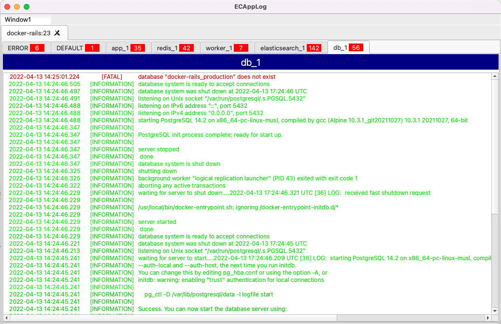

# ECAppLog

ECAppLog is a networked logging GUI, intended to be used by programmers debugging code in a local computer.



It listens at TCP localhost:13991, waiting for applications to connect and send log messages. The protocol is very straightforward, binary with JSON-based payloads. See [Protocol](#protocol) for more details.

It is a Qt-based C++ desktop application, so it is cross-platform (Windows, Mac and Linux), and tries to use as few resources as possible.

## Interface

The interface is based on `applications` containing `categories`. One tab will be created for each connected application, and inside these, one tab will created for each category.

Multiple windows can be created, and docked inside the main window, or float outside it.

Tabs (application and/or category) can be added to a filter, and shown together in a special `FILTER` application, grouped in single or multiple tabs.

Right-clicking the tabs shows context menus with more options.

## Protocol

ECAppLog uses TCP because ordering is very important, and messages cannot be lost.

The GUI listens at localhost, TCP port 13991.

Each protocol message must have this binary format:

```
<uint8_t command><uint32_t payload_size_bytes><bytes... payload>
```

All strings should be UTF-8 encoded.

Currently 2 commands are defined:

**CMD_BANNER (99)**

```
<99><payload size><ECAPPLOG Name-of-application>
```

This must be the first command sent after the connection is established. It sets the application name to be shown at the application tab bar.

**CMD_LOG (0)**

```
<0><payload size><{"time":"2022-04-17T11:32:13.123","priority":"INFORMATION","category":"server","message": "Server started"}>
```

 * Time must ALWAYS be UTC with milliseconds, using this format: `yyyy-MM-ddThh:mm:ss.zzz`
  * Priority must be one of: `TRACE`, `DEBUG`, `INFORMATION`, `NOTICE`, `WARNING`, `FATAL`, `CRITICAL`, `ERROR`
 * If category is blank, it will be added to the `ALL` category

## Clients

 * C++ - [ecapplog-cpp](https://github.com/RangelReale/ecapplog-cpp)
 * Go - [ecapplog-go](https://github.com/RangelReale/ecapplog-go)

## Applications

 * [panyl-ecapplog](https://github.com/RangelReale/panyl-ecapplog)

## Screenshots

Windows

Mac


## Author

Rangel Reale (rangelreale@gmail.com)
