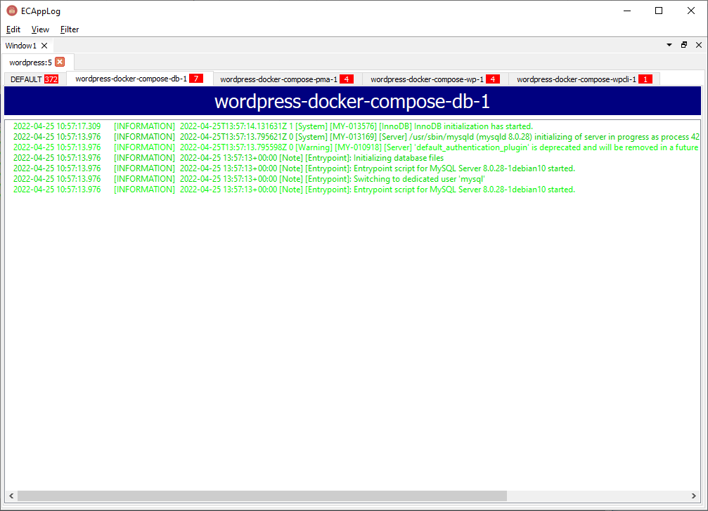

# ECAppLog

ECAppLog is a networked logging GUI, intended to be used by programmers debugging code in a local computer.


It listens at TCP localhost:13991, waiting for applications to connect and send log messages. The protocol is very straightforward, sized binary messages with JSON-based payloads. See [Protocol](#protocol) for more details.

This is a Qt-based C++ desktop application, so it is cross-platform (Windows, Mac and Linux), and tries to use as few resources as possible.

## Interface

The interface is based on `applications` containing `categories`. One tab will be created for each connected application, and inside these, one tab will created for each category.

Multiple windows can be created, and docked inside the main window or float outside it.

Tabs (application and/or category) can be added to a filter, and shown together in a special `FILTER` application, grouped in single or multiple tabs.

Right-clicking the tabs and logs shows context menus with more options.

## Features

 * JSON parsing in worker thread
 * Category items-per-second throttling, decrease amount of screen refreshs if high rate of logs
 * Pause and resume
 * Multiple windows and fiters
 * Slight variation of text color in each line to ease reading
 * Try parse JSON from text selection in detail window (even if escaped)

## Protocol

ECAppLog uses TCP because ordering is very important, and messages cannot be lost.

The GUI listens at localhost, TCP port 13991.

Each protocol message must have this binary format:

```
<uint8_t command><uint32_t payload_size_bytes><bytes... payload>
```

All strings should be UTF-8 encoded, and all binary data should use network byte order.

Currently 2 commands are defined:

**CMD_BANNER (99)**

```
<99><payload size><ECAPPLOG Name-of-application>
```

This must be the first command sent after the connection is established. It sets the application name to be shown at the application tab bar.

**CMD_LOG (0)**

```
<0><payload size><{"time":"2022-04-17T11:32:13.123","priority":"INFORMATION","category":"server","message":"Server started"}>
```

 * Time must ALWAYS be UTC with milliseconds, using this format: `yyyy-MM-ddThh:mm:ss.zzz`
 * Priority must be one of: `TRACE`, `DEBUG`, `INFORMATION`, `NOTICE`, `WARNING`, `FATAL`, `CRITICAL`, `ERROR`
 * If category is blank, it will be added to the `ALL` category

 Optional fields:

 * `source` [string]: sets the original source this log came from, for example, the JSON in the original format, or the raw Apache log line. This can be shown by right-clicking a log and selecting `Details`. This field isn't parsed, besides indenting JSON if it is detected as such.
 * `original_category` [string]: if set, one extra field will be shown on the log with this field. Use this to indicate this log was redirected from another category.
 * `extra_categories` [string array]: duplicate the log in more categories besides the main one.
 * `color` [string]: if set, use this foreground color instead of the priority default one. Format must be `#RRGGBB` (the `#` character is required).
 * `bgcolor` [string]: if set, use this background color. Format must be `#RRGGBB` (the `#` character is required).

## Clients

 * C++ - [ecapplog-cpp](https://github.com/RangelReale/ecapplog-cpp)
 * Go - [ecapplog-go](https://github.com/RangelReale/ecapplog-go)

## Applications

 * [panyl-ecapplog](https://github.com/RangelReale/panyl-ecapplog) - Panyl is a Golang library to parse logs that may have mixed formats, like log files for multiple services in the same file.

## Screenshots

Windows  


Mac  


Linux  


## Author

Rangel Reale (rangelreale@gmail.com)
